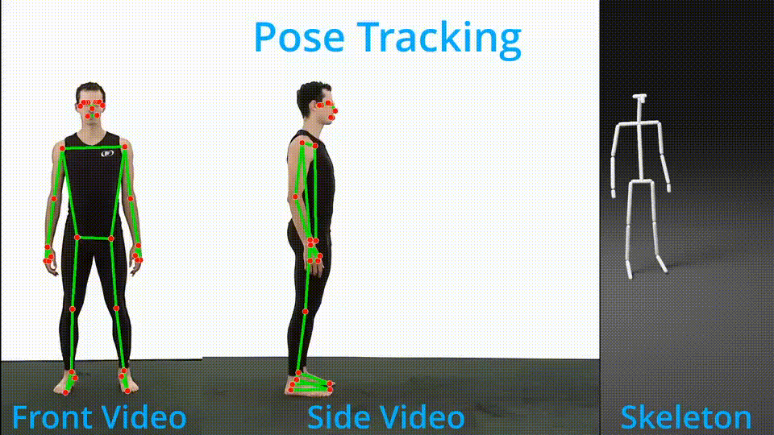
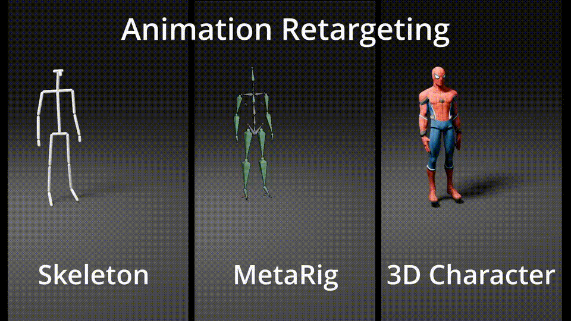

🎬 Open Mocap — AI-Powered Motion Capture for Blender

Open Mocap is an open-source Blender add-on for AI-powered motion capture.
It supports offline full-body pose tracking, offline + real-time hand tracking, and easy retargeting to any rig.
Designed for artists, animators, and researchers who want fast, accessible motion capture inside Blender—no external software required.

---

⚠️ Blender & Dependencies Compatibility

Open Mocap is compatible only with Blender 4.0.0 and earlier.
Newer Blender versions currently do not support the add-on.

Best Compatibilty as of now:

Blender: 4.0.0 or earlier

Python: 3.10 (Blender’s bundled Python — no separate installation required)

MediaPipe: 0.10.14 (Must be installed using the addon)

OpenCV-Python: 4.11.0.86 (Must be installed using the addon)

CVZone: 1.6.1 (Must be installed using the addon)

> **Developer Note:**  
> To ensure Open Mocap works correctly, install the versions listed above. Using newer versions of MediaPipe, OpenCV, CVZone, or Python may cause runtime errors.
> However, developers are welcome to experiment with different versions to identify the best compatible setup. 
> ⚠️ While installing OpenCV, many times a dummy or incorrect version may be installed. Installing and uninstalling the external libraries listed above was a challenging process during development, and this may be a Blender-specific issue.

---

🚀 Features

✔️ Offline full-body motion capture

✔️ Easy Retargeting of captured motion data to any 3D character

✔️ Offline hand tracking

✔️ Realtime hand tracking
✔️ Easy retargeting to any rig
✔️ Blender-native workflow
✔️ Easy installation
✔️ Works fully offline

---

🎓 Tutorial

A complete installation + usage tutorial is available here:

---

🤝 Contributing

Contributions are welcome!

You can help by:

reporting issues

fixing bugs

improving performance

adding new features

contributing documentation

Feel free to open:

Issues → for bugs, questions, feature requests

Pull Requests → for code contributions

---

## Credits

The following test videos included in this repository are the property of the author:

- `Front5.mp4`  
- `Side5.mp4`  

Other test videos were obtained from:  

- [Endless Refernce] https://endlessreference.com https://youtube.com/@endlessreference

These videos are used for testing and demonstration purposes only.

---

📄 License

This project is licensed under the MIT License.
See the LICENSE file for full details.

---

💬 Support

For doubts, improvements, or help with animation/mocap:

📧 Email: larenju23@gmail.com
📂 GitHub Issues: Feel free to open one anytime.

---

🎉 Thank You for Using Open Mocap!

If this add-on helps you, consider ⭐ starring the repository!

